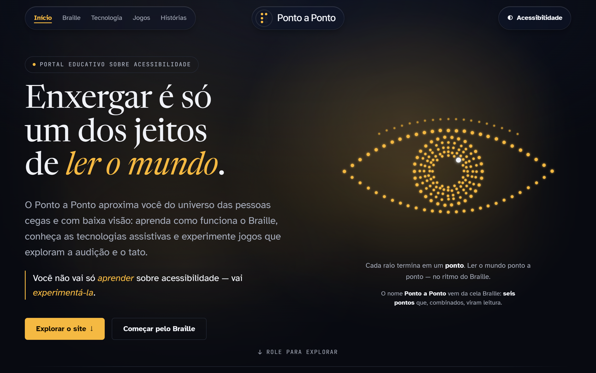

# Ponto a Ponto



Site escolar sobre **acessibilidade** — feito para pessoas cegas, com baixa visão e para o
público geral. Fala sobre Braille, tecnologia assistiva e dados sobre deficiência visual no
Brasil, e serve de porta de entrada para sub-páginas com conteúdos e jogos.

Feito com **HTML, CSS e JavaScript puro** (sem frameworks), em três arquivos:
`index.html`, `style.css` e `script.js`.

## Acessibilidade

O site não é só *sobre* acessibilidade — ele *é* acessível:

- Fonte **Atkinson Hyperlegible** (Braille Institute) em todo o texto de leitura;
- **Alto contraste**, **aumentar/diminuir a fonte** e **leitura em voz alta**;
- Navegação **100% por teclado**, com foco sempre visível;
- Compatível com **leitores de tela** (HTML semântico + ARIA);
- **Respeita "reduzir movimento"** e segue as recomendações de **contraste da WCAG**.

## Como rodar

Abra o `index.html` no navegador, ou sirva a pasta com qualquer servidor estático:

```bash
npx live-server
```

## Turma

<!-- Oculto temporariamente a pedido do Dg — é só descomentar pra voltar:
Projeto da turma **2º EM** — **Colégio Cívico-Militar Castro Alves**, 2026.
-->

- Programação: Douglas ([@dgolaus](https://github.com/dgolaus)) e João Lucas ([@joaomarino767](https://github.com/joaomarino767))
- Conteúdo e design: turma
- Orientação: profª Célia Regina

## Fontes dos dados

Censo Demográfico 2010 — IBGE.
